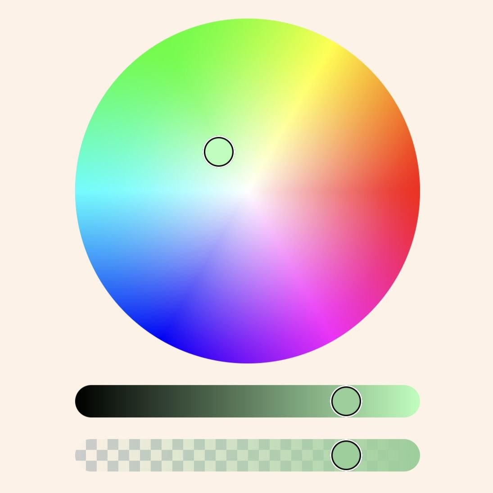
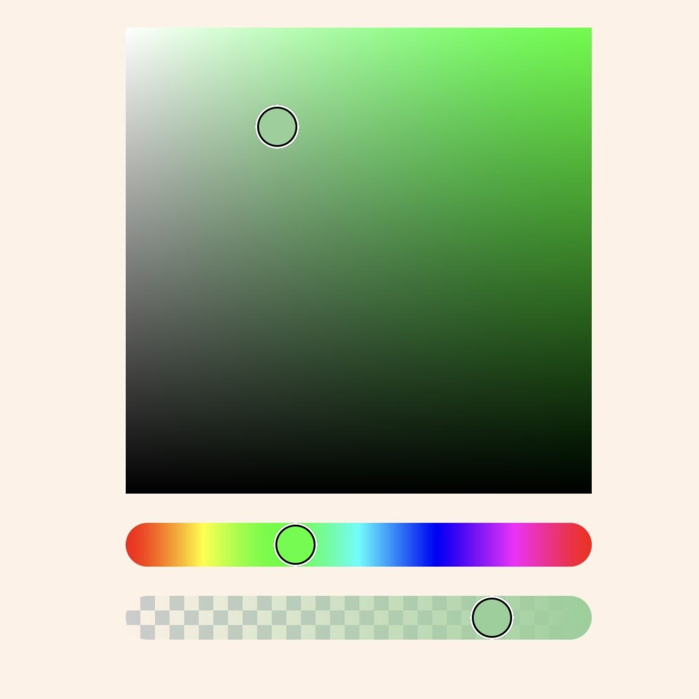
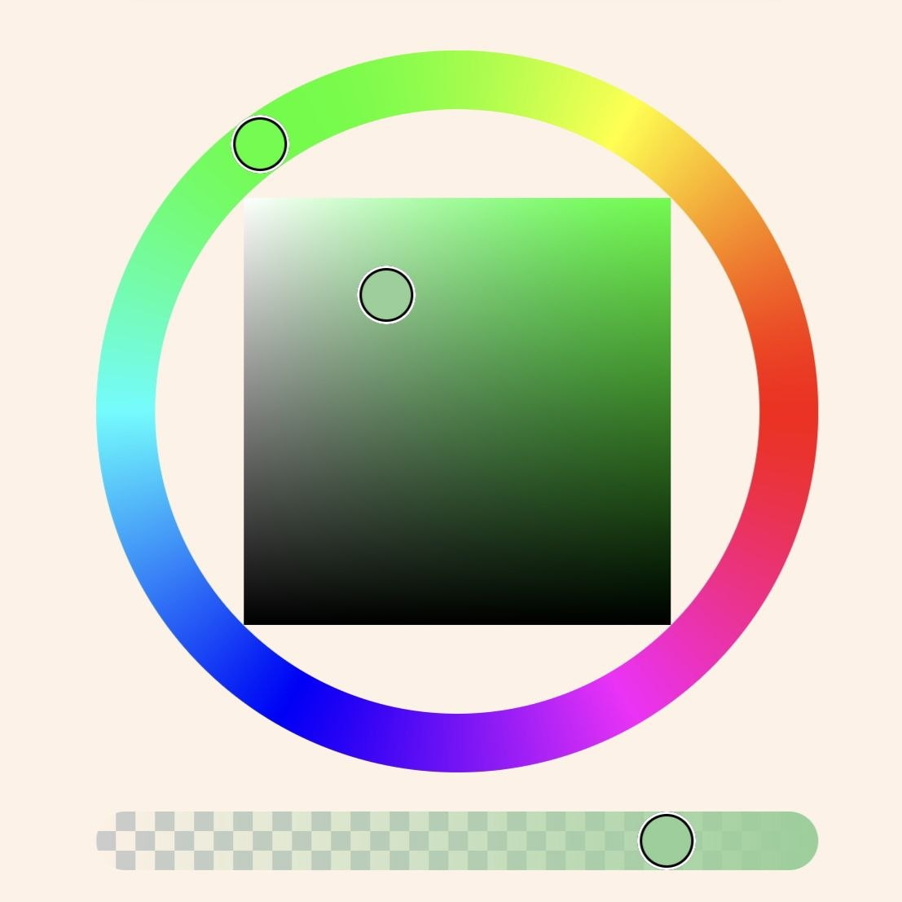
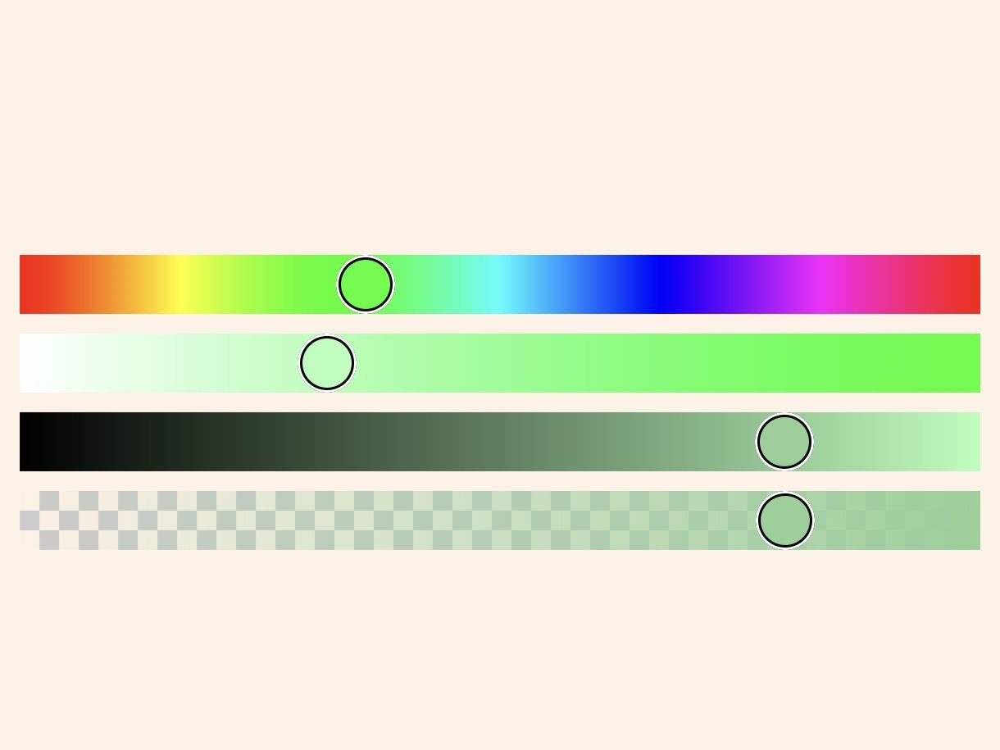

# Превью

<p>




</p>

# Описание

Гибкая библиотека для создания color picker на Jetpack Compose.
Позволяет создать свой собственный color picker в пару строк кода в формате DSL. 
Есть очень гибкая настройка всех основных параметров, таких как размер, цвет указателя, а
также есть возможность создать и использовать свой собственный указатель.

# Быстрый старт

Просто используйте функцию rememberColorPickerState для создания state,
благодаря которому вы сможете получать актуальный выбранный цвет.
После чего воспользуйтесь готовым color picker:

```kotlin
@Composable
fun ColorScreen() {
    val state = rememberColorPickerState(initialColor = Color.Blue)
    
    RingColorPicker(
        modifier = Modifier.fillMaxWidth(),
        state
    )
    
    // state.color - return current color
}
```

В том случае, если вы хотите создать свой color picker, то для начала необходимо воспользоваться
функцией провайдером ColorPicker, после чего описать свой color picker так как бы хотели его видеть:

```kotlin
@Composable
fun ColorScreen() {
    val state = rememberColorPickerState()
    
    ColorPicker(
        modifier = Modifier.fillMaxWidth(),
        state = state
    ) {
        
        RectangleSV(
            modifier = Modifier.fillMaxWidth().aspectRation(1f)
        ) {
            thumbInside = false
        }
        
        Spacer(Modifier.height(16.dp))
        
        HueClider(
            modifier = Modifier.fillMaxWidth().height(24.dp)
        ) {
            thumbSize = DpSize(36.dp, 36.dp)
        }
    }
}
```

# Особенности

Из коробки имеется 4 вида color picker для ваших нужд (они представлены в разделе превью).
Есть возможность отключить альфа слайдер для них, а также задать минимальные настройки.

## Создание своих color picker

Для удобства, созданы все основные и необходимые элементы для реализации своих собственных 
color picker. 

В их число входят такие элементы как:

* CircleHS
* RectangleSV
* HueRing
* AlphaSlider/AlphaSliderVertical
* HueSlider/HueSliderVertical
* SaturationSlider/SaturationSliderVertical
* ValueSlider/ValueSliderVertical

В том случае, если вас не устраивает как реализованы по умолчанию данные элементы, 
либо вы хотите создать свой собственный, можете использовать следующие функции:

* CircleArea
* RectangleArea
* RingSlider
* HorizontalSlider
* VerticalSlider

Данные функции предоставляют удобный DSL формат для их изменения.  


